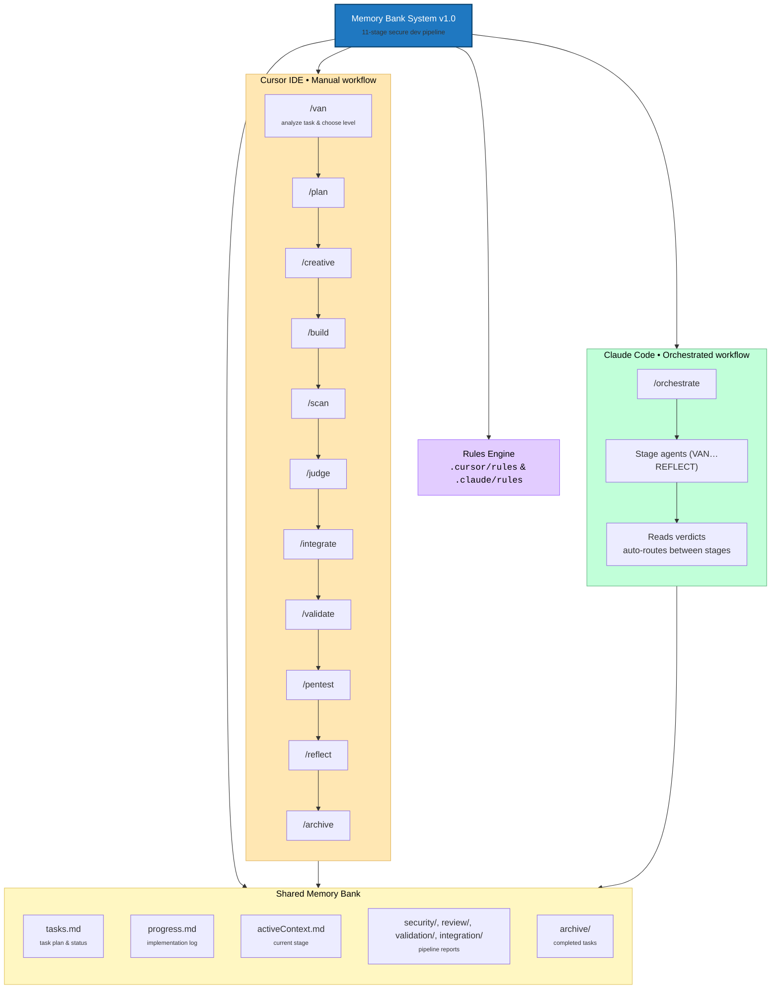
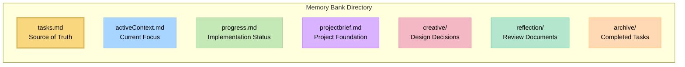

# Claude | Cursor Memory Bank System 1.0

An 11-stage development pipeline with built-in security gates, supporting both **Cursor IDE** (individual commands) and **Claude Code** (automated orchestrator).



> **Personal Note**: This project is my personal hobby project that I develop for my own use in coding projects. I originally took inspiration from and forked the excellent [cursor-memory-bank](https://github.com/vanzan01/cursor-memory-bank) project by `vanzan01`, then evolved this fork to support both **Cursor IDE** commands and **Claude Code** orchestration. As this is a personal project, I don't maintain an issues tracker or actively collect feedback. However, if you're using these rules and encounter issues, you can ask Cursor AI or Claude Code directly to modify or update the rules to better suit your specific workflow. The system is designed to be adaptable by the AI, allowing you to customize it for your own needs without requiring external support.

## About Memory Bank

Memory Bank is a structured development workflow system that guides you through an 11-stage pipeline with built-in security gates. It works with two platforms:

- **Cursor IDE** — 11 individual `/commands` you run stage by stage, with visual maps and rule loading
- **Claude Code** — a single `/orchestrate` command that runs the entire pipeline automatically using subagents

Both platforms share the same `memory-bank/` directory and produce identical outputs. The system uses hierarchical rule loading to optimize token usage and provides tailored guidance at each stage.

### How It Works

Version 1.0 introduces an 11-stage pipeline with security gates. Memory Bank operates through **eleven specialized commands** that work together as an integrated workflow:

1. **`/van`** - Initializes projects, detects platform, determines task complexity
2. **`/plan`** - Creates detailed implementation plans based on complexity level
3. **`/creative`** - Explores design options for components requiring design decisions
4. **`/build`** - Systematically implements planned changes
5. **`/scan`** - Static security analysis, dependency audit, secrets scanning
6. **`/judge`** - Rubric-based code review with scoring and verdicts
7. **`/integrate`** - Component merging, dependency resolution, build verification
8. **`/validate`** - End-to-end behavioral testing and acceptance verification
9. **`/pentest`** - Dynamic security testing and penetration testing (Level 3-4)
10. **`/reflect`** - Reviews completed work and documents lessons learned
11. **`/archive`** - Creates comprehensive documentation and updates Memory Bank

Each command reads from and updates a shared **Memory Bank** directory (`memory-bank/`), maintaining persistent context across the entire workflow.

### Token-Optimized Architecture

The system includes significant token optimization improvements:

- **Hierarchical Rule Loading**: Only loads essential rules initially with specialized lazy-loading (~70% token reduction)
- **Progressive Documentation**: Implements concise templates that scale with task complexity
- **Optimized Command Transitions**: Preserves critical context efficiently between commands
- **Level-Specific Workflows**: Adapts documentation requirements to task complexity (Levels 1-4)
- **Lazy-Loaded Specialized Rules**: Loads specialized rules only when needed (e.g., architecture vs UI/UX design)

See the [Memory Bank Optimizations](MEMORY_BANK_OPTIMIZATIONS.md) document for detailed information about all optimization approaches.

### Command-Based Workflow System

Memory Bank transforms development into a structured, phase-based process:

- **Graph-Based Command Integration**: Commands are interconnected nodes in a development workflow
- **Workflow Progression**: Commands transition from one to another in a logical sequence (`/van` → `/plan` → `/creative` → `/build` → `/scan` → `/judge` → `/integrate` → `/validate` → `/pentest` → `/reflect` → `/archive`)
- **Shared Memory**: Persistent state maintained across command transitions via Memory Bank files
- **Adaptive Behavior**: Each command adjusts its recommendations based on project complexity level
- **Progressive Rule Loading**: Commands load only necessary rules, reducing context window usage

This approach transforms development from ad-hoc coding into a coordinated system with specialized phases working together.

### CREATIVE Command and Claude's "Think" Tool

The `/creative` command is conceptually based on Anthropic's Claude "Think" tool methodology, as described in their [engineering blog](https://www.anthropic.com/engineering/claude-think-tool). Version 1.0 implements an optimized version with:

- Progressive documentation with tabular option comparison
- "Detail-on-demand" approach that preserves token efficiency
- Structured templates that scale with complexity level
- Efficient context preservation for implementation phases

For a detailed explanation of how Memory Bank implements these principles, see the [CREATIVE Mode and Claude's "Think" Tool](creative_mode_think_tool.md) document.

## Supported Platforms

Memory Bank v1.0 works with both **Cursor IDE** and **Claude Code CLI**:

| Feature | Cursor IDE | Claude Code |
|---------|-----------|-------------|
| **Interface** | 11 individual `/commands` | Single `/orchestrate` command |
| **Workflow** | Manual stage-by-stage | Fully automated multi-agent |
| **User control** | Run each stage yourself | Pipeline runs autonomously |
| **Security stages** | `/scan` and `/pentest` commands | Built into orchestrator |
| **Setup** | `.cursor/` directory | `.claude/skills/orchestrate/` |

Both platforms share the same `memory-bank/` directory and produce identical outputs.

## Key Features

- **Dual Platform Support**: Works with both Cursor IDE (commands) and Claude Code (orchestrator)
- **11-Stage Security Pipeline**: Dedicated SCAN and PENTEST stages catch vulnerabilities early
- **Cursor 2.0 Commands**: Native integration with Cursor's commands feature - no setup required
- **Claude Code Orchestrator**: Single `/orchestrate` command runs the full pipeline automatically
- **Hierarchical Rule Loading**: Load only the essential rules with specialized lazy-loading
- **Progressive Documentation**: Concise templates that scale with task complexity
- **Unified Context Transfer**: Efficient context preservation between commands via Memory Bank
- **Command-Specific Visual Maps**: Clear visual representations for each development phase
- **Level-Specific Workflows**: Adapted processes based on complexity (Levels 1-4)
- **Platform-Aware Commands**: Automatically adapts commands to your operating system
- **Memory Bank Integration**: All commands read from and update shared Memory Bank files

## Installation Instructions

### Prerequisites

- **AI Model**: Claude 4 Sonnet or Claude 4 Opus is recommended for best results
- **For Cursor**: Version 2.0 or higher (commands feature)
- **For Claude Code**: Claude Code CLI installed

### Step 1: Get the Files

Simply clone this repository into your project directory:

```bash
git clone https://github.com/vanzan01/cursor-memory-bank.git
```

#### Alternative (Manual)

After extracting it from the ZIP file:

- Copy the `.cursor` folder to your project directory (for Cursor IDE)
- Copy the `.claude` folder to your project directory (for Claude Code)
- Both can coexist — they share the same `memory-bank/` output directory

**Note**: Other documents are not necessary for Memory Bank operation - they are explanatory documents. You can copy them to a folder like `memory_bank_documents` if desired.

### Step 2a: Using Cursor IDE

**Commands are ready to use immediately!** No additional setup required.

1. **Type `/` in the Cursor chat** to see available commands:
   - `/van` - Initialization & entry point
   - `/plan` - Task planning
   - `/creative` - Design decisions
   - `/build` - Code implementation
   - `/scan` - Security analysis
   - `/judge` - Code review
   - `/integrate` - Integration & release prep
   - `/validate` - End-to-end testing
   - `/pentest` - Penetration testing (Level 3-4)
   - `/reflect` - Task reflection
   - `/archive` - Task archiving

2. **Start with `/van`** to initialize your project:
   ```
   /van Initialize project for adding user authentication feature
   ```

3. **Follow the workflow** - each command tells you what to run next

See [`COMMANDS_README.md`](COMMANDS_README.md) for detailed command documentation.

### Step 2b: Using Claude Code

Claude Code uses a single `/orchestrate` command that runs the entire pipeline automatically.

1. **Ensure the skill is loaded**: The `.claude/skills/orchestrate/SKILL.md` file must be in your project
2. **Run the orchestrator**:
   ```
   /orchestrate Add user authentication with OAuth2 support
   ```
3. **The pipeline runs automatically**:
   - Each stage spawns as a subagent (VAN, PLAN, CREATIVE, BUILD, SCAN, JUDGE, etc.)
   - Verdicts are parsed and failures route back automatically
   - You only intervene if a stage fails repeatedly (3 loops max)
   - Progress updates appear after each stage completes

**How it differs from Cursor:**

| Aspect | Cursor IDE | Claude Code |
|--------|-----------|-------------|
| Commands | 11 individual `/commands` you run manually | Single `/orchestrate` runs everything |
| Control | You decide when to move to the next stage | Orchestrator advances automatically |
| Failures | Stage tells you to go back; you re-run | Orchestrator loops back automatically |
| Visibility | Full stage output in chat | Progress summary after each stage |
| Security | Run `/scan` and `/pentest` yourself | SCAN and PENTEST run as subagents |

**Example output:**
```
[VAN] Complete — Level 3 assessed, 10-stage pipeline
[PLAN] Complete — 5 tasks identified, 1 component flagged for creative
[CREATIVE] Complete — 1 design decision documented
[BUILD] Complete — 5/5 tasks implemented, 12 files modified
[SCAN] Complete — Score: 23/25 (92%) PASS, 0 critical, 0 high
[JUDGE] Complete — Score: 22/25 (88%) PASS
[INTEGRATE] Complete — Build passes, 45/45 tests pass
[VALIDATE] Complete — 5/5 acceptance criteria verified, PASS
[PENTEST] Complete — 0 critical, 0 high findings, PASS
[REFLECT] Complete — Pipeline finished, 0 rework cycles
```

## Basic Usage

### Quick Start

1. **Initialize with `/van`**:
   ```
   /van Add user authentication to the application
   ```
   - Analyzes your project structure
   - Determines task complexity (Level 1-4)
   - Creates Memory Bank structure if needed
   - Routes to appropriate next command

2. **Follow the Workflow Based on Complexity**:

   **Level 1 (Quick Bug Fix):**
   ```
   /van → /build → /reflect → /archive
   ```

   **Level 2 (Simple Enhancement):**
   ```
   /van → /plan → /build → /scan → /judge → /reflect
   ```

   **Level 3 (Feature):**
   ```
   /van → /plan → /creative → /build → /scan → /judge → /integrate → /validate → /pentest → /reflect
   ```

   **Level 4 (System):**
   ```
   /van → /plan → /creative → /build → /scan → /judge → /integrate → /validate → /pentest → /reflect → /archive
   ```

### Command Reference

#### `/van` - Initialization & Entry Point
**Purpose:** Initialize Memory Bank, detect platform, determine task complexity, route to workflows.

**Usage:**
```
/van [task description]
```

**What it does:**
- Detects your operating system and adapts commands
- Verifies or creates Memory Bank structure
- Analyzes task requirements
- Determines complexity level (1-4)
- Updates `memory-bank/tasks.md` with initial task information

**Next steps:**
- Level 1 → `/build`
- Level 2-4 → `/plan`

#### `/plan` - Task Planning
**Purpose:** Create detailed implementation plans based on complexity level.

**Usage:**
```
/plan
```

**What it does:**
- Reads task requirements from `memory-bank/tasks.md`
- Reviews codebase structure
- Creates implementation plan (complexity-appropriate)
- Performs technology validation (Level 2-4)
- Identifies components requiring creative phases
- Updates `memory-bank/tasks.md` with complete plan

**Next steps:**
- Creative phases identified → `/creative`
- No creative phases → `/build`

#### `/creative` - Design Decisions
**Purpose:** Perform structured design exploration for flagged components.

**Usage:**
```
/creative
```

**What it does:**
- Reads components flagged for creative work from `memory-bank/tasks.md`
- For each component, explores multiple design options
- Analyzes pros/cons of each approach
- Selects and documents recommended approach
- Creates `memory-bank/creative/creative-[feature_name].md` documents
- Updates `memory-bank/tasks.md` with design decisions

**Next steps:**
- After all creative phases complete → `/build`

#### `/build` - Code Implementation
**Purpose:** Implement planned changes following the plan and creative decisions.

**Usage:**
```
/build
```

**What it does:**
- Reads implementation plan from `memory-bank/tasks.md`
- Reads creative phase documents (Level 3-4)
- Implements changes systematically
- Tests implementation
- Documents commands executed and results
- Updates `memory-bank/tasks.md` and `memory-bank/progress.md`

**Next steps:**
- After implementation complete → `/scan`

#### `/reflect` - Task Reflection
**Purpose:** Facilitate structured reflection on completed implementation.

**Usage:**
```
/reflect
```

**What it does:**
- Reviews completed implementation
- Compares against original plan
- Documents what went well
- Documents challenges encountered
- Documents lessons learned
- Documents process and technical improvements
- Creates `memory-bank/reflection/reflection-[task_id].md`
- Updates `memory-bank/tasks.md` with reflection status

**Next steps:**
- After reflection complete → `/archive`

#### `/archive` - Task Archiving
**Purpose:** Create comprehensive archive documentation and update Memory Bank.

**Usage:**
```
/archive
```

**What it does:**
- Reads reflection document and task details
- Creates comprehensive archive document
- Archives creative phase documents (Level 3-4)
- Updates `memory-bank/tasks.md` marking task COMPLETE
- Updates `memory-bank/progress.md` with archive reference
- Resets `memory-bank/activeContext.md` for next task
- Creates `memory-bank/archive/archive-[task_id].md`

**Next steps:**
- After archiving complete → `/van` (for next task)

### Example Workflow

Here's a complete example workflow for a Level 3 feature:

```bash
# Step 1: Initialize
/van Add user authentication with OAuth2 support

# Step 2: Plan (VAN routes to PLAN for Level 3)
/plan

# Step 3: Explore design options for OAuth integration
/creative

# Step 4: Implement the feature
/build

# Step 5: Security scan
/scan

# Step 6: Code review
/judge

# Step 7: Integration
/integrate

# Step 8: Validation
/validate

# Step 9: Penetration testing
/pentest

# Step 10: Reflect on the implementation
/reflect
```

## Memory Bank Structure

All Memory Bank files are stored in the `memory-bank/` directory:



### Core Files

- **`tasks.md`**: Central source of truth for task tracking, checklists, and component lists
- **`activeContext.md`**: Maintains focus of current development phase
- **`progress.md`**: Tracks implementation status and observations
- **`projectbrief.md`**: Project foundation and context
- **`productContext.md`**: Product-specific context and requirements
- **`systemPatterns.md`**: System patterns and architectural decisions
- **`techContext.md`**: Technical context and technology stack

### Generated Files

- **`creative/creative-[feature_name].md`**: Design decision documents (Level 3-4)
- **`security/scan-[task_id].md`**: Security scan reports (Level 2-4)
- **`security/pentest-[task_id].md`**: Penetration test reports (Level 3-4)
- **`review/review-[task_id].md`**: Code review reports (Level 2-4)
- **`integration/integration-[task_id].md`**: Integration reports (Level 3-4)
- **`validation/validation-[task_id].md`**: Validation reports (Level 3-4)
- **`reflection/reflection-[task_id].md`**: Reflection documents
- **`archive/archive-[task_id].md`**: Archive documents for completed tasks

## Progressive Rule Loading

Each command implements progressive rule loading to optimize context usage:

1. **Core Rules** - Always loaded first
   - `main.mdc` - System foundation
   - `memory-bank-paths.mdc` - File path definitions

2. **Command-Specific Rules** - Loaded based on command
   - Visual process maps (e.g., `van-mode-map.mdc`)
   - Command-specific workflows

3. **Complexity-Specific Rules** - Loaded based on task complexity
   - Level 1: `workflow-level1.mdc`
   - Level 2: `workflow-level2.mdc`, `task-tracking-basic.mdc`
   - Level 3: `workflow-level3.mdc`, `planning-comprehensive.mdc`
   - Level 4: `workflow-level4.mdc`, `architectural-planning.mdc`

4. **Specialized Rules** - Lazy loaded only when needed
   - Creative phase types (architecture, UI/UX, algorithm)
   - Advanced verification rules
   - Platform-specific adaptations

This approach reduces initial token usage by **~70%** compared to loading all rules at once.

## Complexity Levels

Memory Bank adapts its workflow based on task complexity:

### Level 1: Quick Bug Fix
- **Workflow**: `/van` → `/build` → `/reflect`
- **Characteristics**: Single file changes, targeted fixes
- **Documentation**: Minimal, focused on the fix

### Level 2: Simple Enhancement
- **Workflow**: `/van` → `/plan` → `/build` → `/scan` → `/judge` → `/reflect`
- **Characteristics**: Multiple files, clear requirements
- **Documentation**: Basic plan, security scan, code review

### Level 3: Intermediate Feature
- **Workflow**: `/van` → `/plan` → `/creative` → `/build` → `/scan` → `/judge` → `/integrate` → `/validate` → `/pentest` → `/reflect`
- **Characteristics**: New components, design decisions needed
- **Documentation**: Comprehensive plan, creative phases, security gates, detailed reflection

### Level 4: Complex System
- **Workflow**: `/van` → `/plan` → `/creative` → `/build` → `/scan` → `/judge` → `/integrate` → `/validate` → `/pentest` → `/reflect` → `/archive`
- **Characteristics**: Multiple subsystems, architectural decisions
- **Documentation**: Phased implementation, security gates, architectural diagrams, comprehensive archive

## Troubleshooting

### Commands Not Appearing

- **Verify Cursor version**: Ensure you're using Cursor 2.0 or higher
- **Check file location**: Ensure `.cursor/commands/` directory exists in project root
- **Restart Cursor**: Sometimes a restart is needed to detect new commands

### Command Not Working Correctly

- **Check Memory Bank**: Verify `memory-bank/` directory exists
- **Verify task status**: Check `memory-bank/tasks.md` for current task state
- **Review command order**: Ensure you're following the correct workflow sequence
- **Check rules**: Verify `.cursor/rules/isolation_rules/` directory exists

### Rules Not Loading

- **Verify file paths**: Ensure rule files are in `.cursor/rules/isolation_rules/`
- **Check file permissions**: Verify files are readable
- **Review command logs**: Check what rules the command is trying to load

### Memory Bank Issues

- **Missing files**: Run `/van` to initialize Memory Bank structure
- **Corrupted state**: Check `memory-bank/tasks.md` for task status
- **File conflicts**: Review recent changes to Memory Bank files

## Legacy Custom Modes (Deprecated)

> **Note**: Custom modes are deprecated in favor of Cursor 2.0 commands. If you're using Cursor 2.0+, please use commands instead. Custom modes setup instructions are available in the `custom_modes/` directory for reference only.

If you're using an older version of Cursor that doesn't support commands, see the [Commands Migration Guide](CURSOR_COMMANDS_MIGRATION.md) for information about the legacy custom modes setup.

## Version Information

This is version v1.0 of the Memory Bank system. It introduces an 11-stage pipeline with dedicated SCAN and PENTEST security stages, Claude Code orchestrator support, and all prior token optimization improvements. See the [Release Notes](RELEASE_NOTES.md) for detailed information about the changes.

### Ongoing Development

The Memory Bank system is actively being developed and improved. Key points to understand:

- **Work in Progress**: This is a beta version with ongoing development. Expect regular updates, optimizations, and new features.
- **Feature Optimization**: The modular architecture enables continuous refinement without breaking existing functionality.
- **Previous Version Available**: If you prefer the stability of the previous version (v0.1-legacy), you can continue using it while this version matures.
- **Architectural Benefits**: Before deciding which version to use, please read the [Memory Bank Upgrade Guide](memory_bank_upgrade_guide.md) to understand the significant benefits of the new architecture.

## Resources

- [Commands Documentation](COMMANDS_README.md) - Detailed command usage guide
- [Commands Migration Guide](CURSOR_COMMANDS_MIGRATION.md) - Migration from custom modes to commands
- [Memory Bank Optimizations](MEMORY_BANK_OPTIMIZATIONS.md) - Detailed overview of token efficiency improvements
- [Release Notes](RELEASE_NOTES.md) - Information about the latest changes
- [Memory Bank Upgrade Guide](memory_bank_upgrade_guide.md) - Understanding the new architecture
- [CREATIVE Mode and Claude's "Think" Tool](creative_mode_think_tool.md) - Design methodology explanation

## Contributing

As mentioned in the personal note above, Memory Bank is a personal project. However, if you find it useful and want to adapt it for your own needs, you can:

1. **Ask Cursor AI**: Modify the rules and commands directly using Cursor AI
2. **Fork and Customize**: Clone the repository and adapt it to your workflow
3. **Share Improvements**: If you make useful improvements, consider sharing them with the community

---

*Note: This README is for v1.0 and subject to change as the system evolves.*
