# Cursor Memory Bank: User Guide

A practical guide to using the Memory Bank system for feature development. This guide covers both **Cursor IDE** (individual stage commands) and **Claude Code** (automated orchestrator), walking through the complete workflow from creating a feature branch to archiving a completed task.

---

## Table of Contents

1. [Quick Start](#quick-start)
2. [System Overview](#system-overview)
3. [Setting Up a New Feature](#setting-up-a-new-feature)
4. [The 11-Stage Pipeline](#the-11-stage-pipeline)
5. [Complexity Levels](#complexity-levels)
6. [Stage-by-Stage Walkthrough](#stage-by-stage-walkthrough)
7. [Memory Bank Directory Structure](#memory-bank-directory-structure)
8. [Agent Roles](#agent-roles)
9. [Failure Routing & Recovery](#failure-routing--recovery)
10. [Tips & Best Practices](#tips--best-practices)
11. [Troubleshooting](#troubleshooting)

---

## Quick Start

### Cursor IDE
```
1. Create a feature branch
2. Open Cursor IDE in the project
3. Type: /van <describe your task>
4. Follow the routed commands: /plan -> /creative -> /build -> /scan -> /judge -> ...
5. Each command tells you what to do next
```

### Claude Code
```
1. Create a feature branch
2. Open Claude Code in the project directory
3. Type: /orchestrate <describe your task>
4. The pipeline runs automatically — sit back and watch
5. Intervene only if a stage fails repeatedly
```

Both approaches produce the same outputs in `memory-bank/`. The rest of this guide explains what happens at each stage and why.

---

## System Overview

The Memory Bank system is a structured development pipeline that breaks feature development into discrete stages, each with a specific purpose, agent role, and set of outputs. It supports two interfaces:

- **Cursor IDE**: 11 individual `/commands` — you run each stage manually and control the pace
- **Claude Code**: Single `/orchestrate` command — the pipeline runs automatically as multi-agent orchestration

### The Pipeline

```mermaid
graph LR
    VAN["1. /van<br>Initialize"] --> PLAN["2. /plan<br>Plan"]
    PLAN --> CREATIVE["3. /creative<br>Design"]
    CREATIVE --> BUILD["4. /build<br>Implement"]
    BUILD --> SCAN["5. /scan<br>Security"]
    SCAN --> JUDGE["6. /judge<br>Review"]
    JUDGE --> INTEGRATE["7. /integrate<br>Merge"]
    INTEGRATE --> VALIDATE["8. /validate<br>Test"]
    VALIDATE --> PENTEST["9. /pentest<br>Pen Test"]
    PENTEST --> REFLECT["10. /reflect<br>Retrospect"]
    REFLECT --> ARCHIVE["11. /archive<br>Document"]

```

### What It Produces

Every feature you build generates a structured set of documents in a `memory-bank/` directory at your project root. These documents persist across Cursor sessions, giving the AI full context of your project, decisions, and progress.

### How It Works

Each `/command` you type:
1. Loads stage-specific rules that tell the AI how to behave
2. Reads context from previous stages via Memory Bank files
3. Performs the stage's work (planning, coding, reviewing, etc.)
4. Writes outputs back to Memory Bank
5. Tells you what command to run next

---

## Setting Up a New Feature

### Step 1: Create Your Feature Branch

```bash
git checkout -b feature/user-authentication
```

### Step 2: Open Cursor IDE

Open your project in Cursor. The `.cursor/` directory in your repo contains all the rules and commands the system needs. No additional setup required.

### Step 3: Start with /van

In Cursor's chat, type your first command:

```
/van Add OAuth2 user authentication with Google and GitHub providers
```

The `/van` command is always your entry point. It does three critical things:

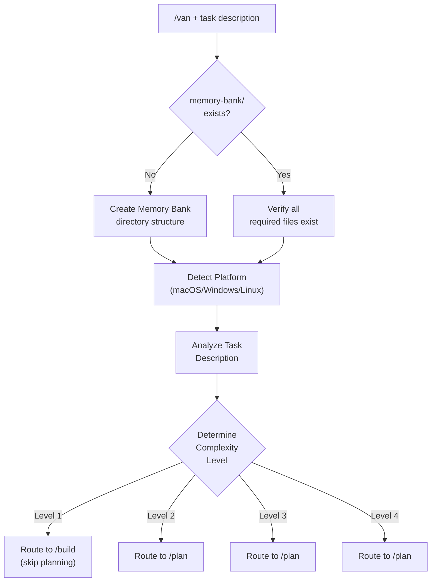

After `/van` completes, it will tell you which command to run next. Just follow its instructions.

### What If memory-bank/ Already Exists?

If you've used Memory Bank before on this project, `/van` will verify the existing structure and reuse it. Previous archive files are preserved, giving the AI historical context about your project.

---

## The 11-Stage Pipeline

Not every task uses all 11 stages. The system adapts based on complexity:

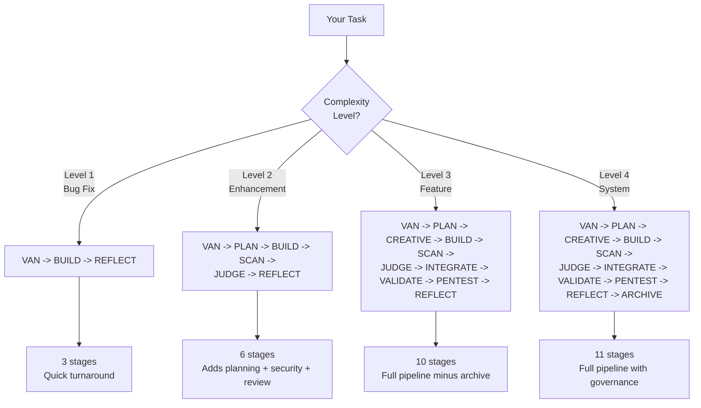

---

## Complexity Levels

The `/van` command determines complexity automatically. Here's how it decides:

### Level 1: Quick Bug Fix
- **Scope:** Single component, targeted fix
- **Examples:** Fix a broken button, correct a typo, resolve a validation error
- **Signals:** "fix", "broken", "bug", "error", "typo"
- **Duration:** Minutes to hours
- **Stages:** VAN -> BUILD -> REFLECT

### Level 2: Simple Enhancement
- **Scope:** Multiple files, clear requirements, single subsystem
- **Examples:** Add a form field, improve validation logic, add a new API endpoint
- **Signals:** "add", "improve", "update", "enhance"
- **Duration:** Hours to 1-2 days
- **Stages:** VAN -> PLAN -> BUILD -> SCAN -> JUDGE -> REFLECT

### Level 3: Intermediate Feature
- **Scope:** Multiple components, design decisions needed, new capability
- **Examples:** User authentication, search functionality, dashboard, notification system
- **Signals:** "implement", "create", "develop", "feature"
- **Duration:** Days to 1-2 weeks
- **Stages:** VAN -> PLAN -> CREATIVE -> BUILD -> SCAN -> JUDGE -> INTEGRATE -> VALIDATE -> PENTEST -> REFLECT

### Level 4: Complex System
- **Scope:** Multiple subsystems, architectural changes, enterprise-grade
- **Examples:** Payment processing system, microservice architecture, data pipeline
- **Signals:** "system", "architecture", "redesign", "platform"
- **Duration:** Weeks to months
- **Stages:** All 11 stages

---

## Stage-by-Stage Walkthrough

### Stage 1: VAN — Initialization

**Command:** `/van <task description>`
**Agent Role:** Analyst
**Purpose:** Set up the project context and determine the right workflow

**What you type:**
```
/van Implement user authentication with OAuth2 support for Google and GitHub
```

**What happens:**
1. Creates/verifies `memory-bank/` directory with all required files
2. Detects your platform (macOS, Windows, Linux)
3. Analyzes your task description and codebase
4. Determines complexity level (1-4)
5. Initializes `tasks.md` and `activeContext.md`

**What you get:**
- Complexity level determination with justification
- Initialized Memory Bank
- Clear instruction on which command to run next

**Files created/updated:**
- `memory-bank/tasks.md` — Task entry with complexity level
- `memory-bank/activeContext.md` — Current focus set

---

### Stage 2: PLAN — Task Planning

**Command:** `/plan`
**Agent Role:** Architect
**Purpose:** Break down the task into a structured implementation plan

**What you type:**
```
/plan
```

**What happens:**

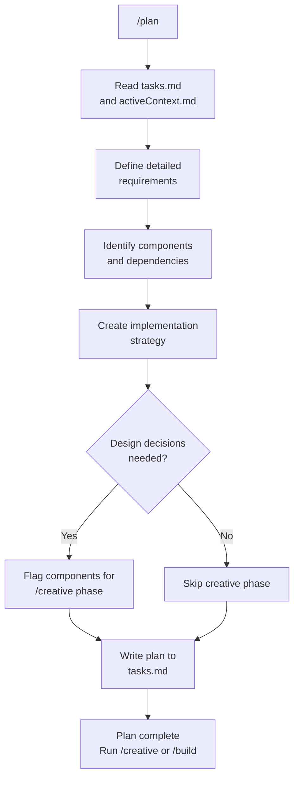

**What you get:**
- Detailed implementation plan in `tasks.md`
- Component breakdown with dependencies
- Identification of which parts need design exploration
- Clear next step: `/creative` (if design decisions needed) or `/build` (if not)

**Example output in tasks.md:**
```markdown
## Task: User Authentication with OAuth2
### Complexity: Level 3
### Requirements
- OAuth2 integration with Google and GitHub
- Session management with JWT tokens
- Login/logout UI components
- Protected route middleware

### Implementation Plan
1. OAuth provider configuration
2. Authentication middleware
3. Login/logout flow
4. Token refresh mechanism
5. Protected route wrapper

### Components Requiring Creative Phase
- [ ] Authentication architecture (JWT vs sessions)
- [ ] Login UI design approach
```

---

### Stage 3: CREATIVE — Design Decisions

**Command:** `/creative`
**Agent Role:** Designer
**Purpose:** Explore design options, analyze trade-offs, document decisions

This stage runs once for each component flagged in the plan. It follows a structured 5-step process:

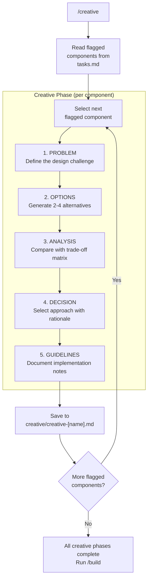

**What you get:**
- Design decision documents for each component requiring exploration
- Trade-off analysis with clear rationale
- Implementation guidelines derived from design decisions

**Example creative document:**
```markdown
# Creative Phase: Authentication Architecture

## Problem
Need to choose between JWT tokens and server-side sessions for auth state management.

## Options
### Option A: JWT with HttpOnly Cookies
- Stateless, horizontally scalable
- No server-side session storage needed

### Option B: Server-Side Sessions with Redis
- Revocable, simpler token management
- Requires session store infrastructure

## Analysis
| Criterion      | JWT + Cookies | Server Sessions |
|---------------|---------------|-----------------|
| Scalability   | Excellent     | Good (with Redis) |
| Revocability  | Poor          | Excellent       |
| Complexity    | Moderate      | Moderate        |
| Performance   | Better        | Slightly slower |

## Decision
JWT with HttpOnly Cookies selected. Rationale: Better scalability for our
use case, and we can implement a token blacklist for critical revocation needs.

## Implementation Guidelines
- Use `jose` library for JWT operations
- Set HttpOnly, Secure, SameSite=Strict on cookies
- Implement CSRF protection with double-submit pattern
- Access token: 15min expiry, Refresh token: 7 days
```

---

### Stage 4: BUILD — Implementation

**Command:** `/build`
**Agent Role:** Developer
**Purpose:** Implement the planned feature with test-driven development

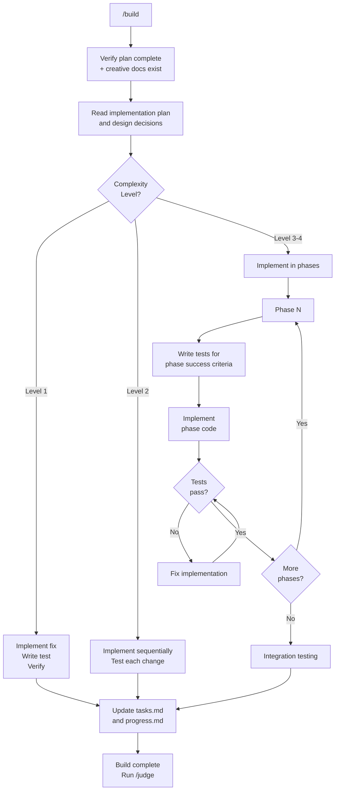

**Key principle: Test-driven phase gating.** For Level 3-4 tasks, each implementation phase has success criteria. Tests must pass before moving to the next phase. This prevents building on a broken foundation.

**What you get:**
- Working implementation
- Passing tests for all success criteria
- Updated `tasks.md` with progress and test results
- Updated `progress.md` with implementation details

---

### Stage 5: SCAN — Security Analysis

**Command:** `/scan`
**Agent Role:** Security Analyst
**Purpose:** Static security analysis to catch vulnerabilities before code review

**What you type:**
```
/scan
```

**What happens:**

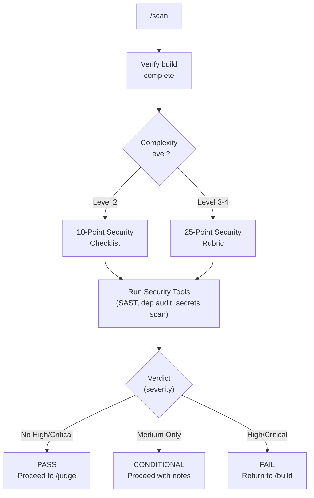

**The 5 Security Categories (Level 3-4):**

| Category | What It Checks |
|----------|---------------|
| **SAST Findings** | Injection, XSS, SSRF, path traversal, deserialization |
| **Dependency Security** | CVEs, end-of-life packages, lock file integrity |
| **Secrets Management** | Hardcoded secrets, gitignore coverage, env var usage |
| **OWASP Compliance** | Auth patterns, input validation, output encoding, error handling |
| **Security Architecture** | Trust boundaries, encryption, least privilege, defense in depth |

**What you get:**
- Scan report in `memory-bank/security/scan-[task_id].md`
- Findings by severity (Critical, High, Medium, Low)
- Clear verdict: PASS, CONDITIONAL, or FAIL
- Remediation guidance (if FAIL)

---

### Stage 6: JUDGE — Code Review

**Command:** `/judge`
**Agent Role:** Code Reviewer
**Purpose:** Evaluate code quality using a structured rubric

The review scope scales with complexity:

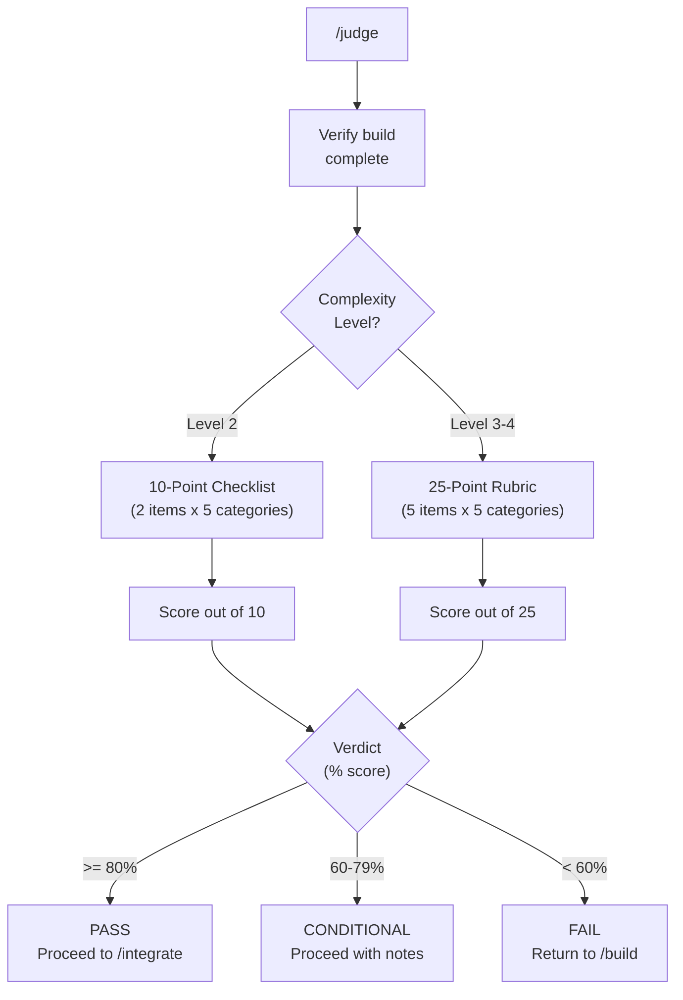

**The 5 Review Categories:**

| Category | What It Checks |
|----------|---------------|
| **Code Quality** | Naming, organization, DRY, style, abstraction level |
| **Architecture & Design** | Plan adherence, creative decisions applied, SoC, modularity |
| **Testing & Reliability** | Unit tests, integration tests, edge cases, error handling |
| **Security & Performance** | No secrets, input sanitization, auth checks, bottlenecks |
| **Documentation** | Comments, API docs, README, changelog, config docs |

**What you get:**
- Review report in `memory-bank/review/review-[task_id].md`
- Per-category scores and specific feedback
- Clear verdict: PASS, CONDITIONAL, or FAIL
- Required fixes list (if FAIL)

---

### Stage 7: INTEGRATE — Integration & Release Prep

**Command:** `/integrate`
**Agent Role:** Release Engineer
**Purpose:** Merge components, resolve dependencies, verify the build

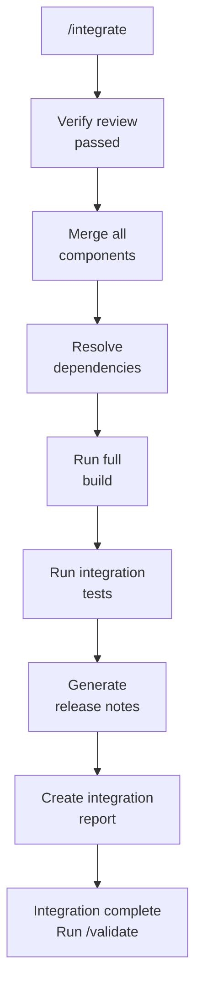

**What you get:**
- Integration report in `memory-bank/integration/integration-[task_id].md`
- Verified build with all components merged
- Dependency compatibility confirmed
- Release notes documenting changes

---

### Stage 8: VALIDATE — End-to-End Testing

**Command:** `/validate`
**Agent Role:** QA Engineer
**Purpose:** Verify the feature works from the user's perspective

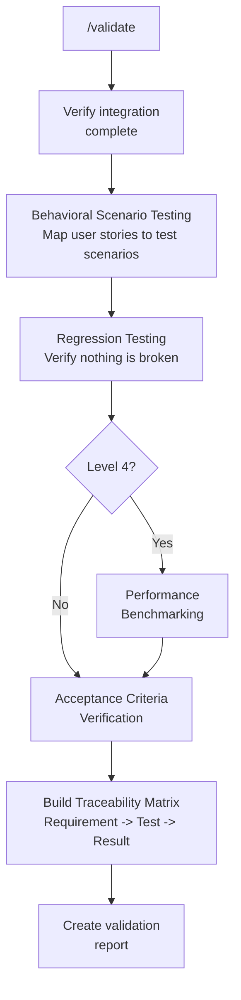

**The Traceability Matrix:**

| Requirement | Test Scenario | Result | Criteria Met |
|-------------|--------------|--------|-------------|
| Users can log in with Google | OAuth Google flow test | Pass | Yes |
| Users can log in with GitHub | OAuth GitHub flow test | Pass | Yes |
| Invalid tokens are rejected | Expired token test | Pass | Yes |
| Sessions persist across refresh | Token refresh test | Pass | Yes |

**What you get:**
- Validation report in `memory-bank/validation/validation-[task_id].md`
- Behavioral test results
- Regression test results
- Traceability matrix linking requirements to test results
- Performance benchmarks (Level 4 only)

---

### Stage 9: PENTEST — Penetration Testing

**Command:** `/pentest`
**Agent Role:** Penetration Tester
**Purpose:** Dynamic security testing against the integrated system (Level 3-4 only)

**What you type:**
```
/pentest
```

**What happens:**

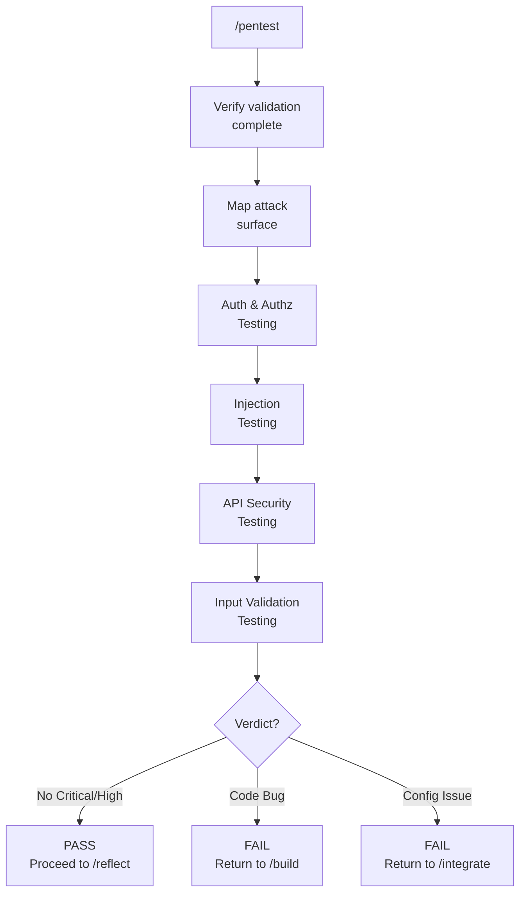

**What It Tests:**

| Category | Tests |
|----------|-------|
| **Authentication** | Login bypass, session management, privilege escalation, IDOR |
| **Injection** | SQL injection, XSS, command injection, path traversal, SSRF |
| **API Security** | Rate limiting, CORS, security headers, error disclosure |
| **Input Validation** | Boundary values, malformed data, file uploads, logic bypass |

**What you get:**
- Pentest report in `memory-bank/security/pentest-[task_id].md`
- Attack surface map
- Findings by severity with remediation guidance
- Failure routing (code bugs → BUILD, config issues → INTEGRATE)

---

### Stage 10: REFLECT — Retrospective

**Command:** `/reflect`
**Agent Role:** Analyst
**Purpose:** Document lessons learned and process improvements

**What you type:**
```
/reflect
```

**What happens:**
- Reviews the entire development lifecycle for this task
- Compares outcomes against the original plan
- Documents what went well and what was challenging
- Identifies process and technical improvements
- Creates a reflection document

**What you get:**
- Reflection document in `memory-bank/reflection/reflection-[task_id].md`
- Structured retrospective: Summary, Successes, Challenges, Lessons, Improvements

---

### Stage 11: ARCHIVE — Knowledge Preservation

**Command:** `/archive`
**Agent Role:** Analyst
**Purpose:** Consolidate all documentation and prepare for the next task

**What happens:**
- Consolidates all task documents into a single archive
- Creates cross-references between documents
- Marks the task as COMPLETED in `tasks.md`
- Resets `activeContext.md` for the next task
- Clears ephemeral data from `tasks.md`

**What you get:**
- Archive document in `memory-bank/archive/archive-[task_id].md`
- Clean Memory Bank ready for the next `/van` invocation

---

## Memory Bank Directory Structure

After running through a complete pipeline, your project will have this structure:

```
your-project/
├── memory-bank/
│   ├── tasks.md                              # Active task (ephemeral, cleared after archive)
│   ├── activeContext.md                      # Current focus
│   ├── progress.md                           # Implementation status
│   ├── projectbrief.md                       # Project foundation (persists across tasks)
│   ├── productContext.md                     # Product context (persists)
│   ├── systemPatterns.md                     # Architecture patterns (persists)
│   ├── techContext.md                        # Tech stack (persists)
│   ├── style-guide.md                        # Code style (persists)
│   ├── creative/
│   │   ├── creative-auth-architecture.md     # Design decision
│   │   └── creative-login-ui.md              # Design decision
│   ├── review/
│   │   └── review-auth-001.md                # Code review report
│   ├── integration/
│   │   └── integration-auth-001.md           # Integration report
│   ├── validation/
│   │   └── validation-auth-001.md            # Validation report
│   ├── security/
│   │   ├── scan-auth-001.md                  # Security scan report
│   │   └── pentest-auth-001.md               # Penetration test report
│   ├── reflection/
│   │   └── reflection-auth-001.md            # Retrospective
│   └── archive/
│       └── archive-auth-001.md               # Completed task archive
└── .cursor/
    ├── commands/                              # Stage commands (van, plan, etc.)
    └── rules/isolation_rules/                # Rules, visual maps, workflows
```

### File Lifecycle

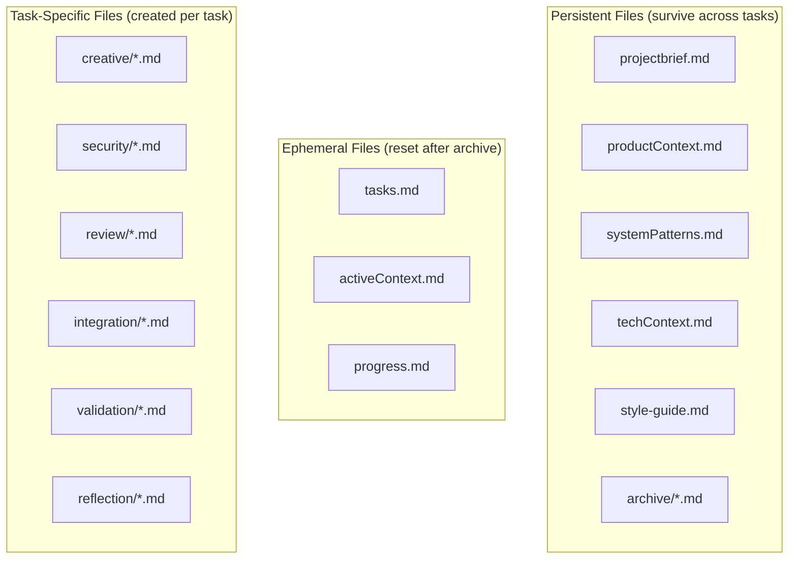

**Why this matters:** Persistent files accumulate project knowledge over time. When you start a new task with `/van`, the AI reads `projectbrief.md`, `systemPatterns.md`, `techContext.md`, and archive files to understand your project's history and conventions. Each task makes the AI smarter about your project.

---

## Agent Roles

Each pipeline stage activates a specialized agent persona that shapes how the AI approaches the work:

```mermaid
graph LR
    VAN["VAN<br>Analyst"] -->|context| PLAN["PLAN<br>Architect"]
    PLAN -->|plan| CREATIVE["CREATIVE<br>Designer"]
    CREATIVE -->|decisions| BUILD["BUILD<br>Developer"]
    BUILD -->|code| SCAN["SCAN<br>Security Analyst"]
    SCAN -->|findings| JUDGE["JUDGE<br>Code Reviewer"]
    JUDGE -->|verdict| INTEGRATE["INTEGRATE<br>Release Engineer"]
    INTEGRATE -->|build| VALIDATE["VALIDATE<br>QA Engineer"]
    VALIDATE -->|results| PENTEST["PENTEST<br>Pen Tester"]
    PENTEST -->|findings| REFLECT["REFLECT<br>Analyst"]
    REFLECT -->|lessons| ARCHIVE["ARCHIVE<br>Analyst"]

```

| Stage | Role | Focus | Key Output |
|-------|------|-------|------------|
| VAN | Analyst | Fact-gathering, assessment | Complexity level, initialized Memory Bank |
| PLAN | Architect | System design, decomposition | Implementation plan, dependency map |
| CREATIVE | Designer | Option exploration, trade-offs | Design decision documents |
| BUILD | Developer | TDD, iterative implementation | Working code, passing tests |
| SCAN | Security Analyst | Static security analysis, OWASP | Scan report with findings and verdict |
| JUDGE | Code Reviewer | Rubric-based quality assessment | Review report with scores and verdict |
| INTEGRATE | Release Engineer | Merging, compatibility, builds | Integration report, release notes |
| VALIDATE | QA Engineer | User-perspective testing | Validation report, traceability matrix |
| PENTEST | Pen Tester | Dynamic security testing, attack sim | Pentest report with findings and verdict |
| REFLECT | Analyst | Retrospective analysis | Lessons learned document |
| ARCHIVE | Analyst | Knowledge consolidation | Comprehensive archive |

---

## Failure Routing & Recovery

Not everything passes on the first try. The pipeline has built-in routing for failures:

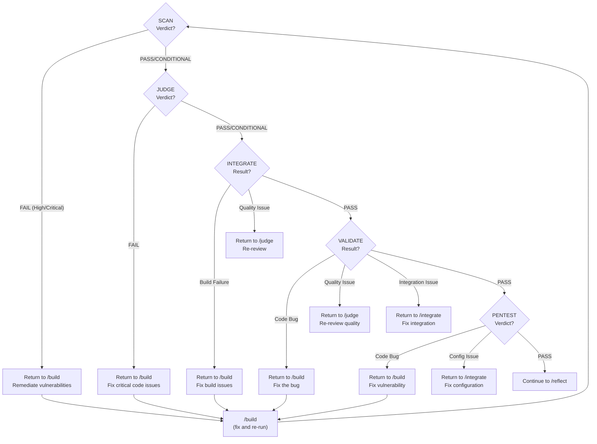

**The key insight:** Failures always route to the stage that can fix the problem. A security vulnerability goes back to BUILD. A quality concern goes back to JUDGE. An integration conflict goes back to INTEGRATE. A config issue from pentest goes back to INTEGRATE. You never have to figure out what to do -- the system tells you.

---

## Complete Example: Building a Feature (Level 3)

Here's what a real Level 3 feature development looks like from start to finish.

### Scenario: Add a notification system to a web application

**1. Initialize**
```
/van Implement an in-app notification system with real-time updates,
read/unread tracking, and notification preferences
```

The AI determines this is Level 3 (multiple components, design decisions needed) and creates the Memory Bank structure.

**2. Plan**
```
/plan
```

The AI creates a plan in `tasks.md`:
- Component 1: Notification data model and API
- Component 2: Real-time delivery (WebSocket vs SSE -- flagged for creative)
- Component 3: Notification UI components (flagged for creative)
- Component 4: User preferences management
- Component 5: Read/unread state tracking

**3. Design**
```
/creative
```

The AI runs two creative phases:
- **Creative Phase 1:** Real-time delivery -- explores WebSocket, SSE, and polling. Decides on SSE for simplicity and browser compatibility. Saves to `creative/creative-realtime-delivery.md`.
- **Creative Phase 2:** Notification UI -- explores toast notifications, notification center, and inline alerts. Decides on notification center with toast for urgent items. Saves to `creative/creative-notification-ui.md`.

**4. Implement**
```
/build
```

The AI implements in phases:
- Phase 1: Data model + API endpoints (tests pass)
- Phase 2: SSE real-time delivery (tests pass)
- Phase 3: Notification center UI (tests pass)
- Phase 4: Preferences management (tests pass)
- Phase 5: Read/unread tracking (tests pass)
- Integration testing across all components

**5. Security Scan**
```
/scan
```

Full 25-point security rubric. Score: 24/25 (PASS). No hardcoded secrets, dependencies clean, input validation in place. One low-severity note about missing CSP header.

**6. Review**
```
/judge
```

Full 25-point rubric review. Score: 21/25 (PASS).
Feedback: Good separation of concerns, solid test coverage. Minor suggestions for error handling in SSE reconnection logic.

**7. Integrate**
```
/integrate
```

All components merged, dependencies verified, build passes, integration tests pass. Release notes generated.

**8. Validate**
```
/validate
```

Behavioral scenarios:
- User receives notification in real-time: PASS
- User marks notification as read: PASS
- User updates notification preferences: PASS
- Notification persists across page refresh: PASS
- Regression: existing features unaffected: PASS

**9. Penetration Test**
```
/pentest
```

Attack surface mapped. Auth testing: no bypass found. Injection testing: all inputs properly sanitized. API security: rate limiting in place, CORS restrictive. Verdict: PASS with 0 critical/high findings.

**10. Retrospect**
```
/reflect
```

Lessons captured:
- SSE was the right choice -- simpler than WebSocket for one-way updates
- Should have planned the preferences schema earlier
- Test-driven approach caught an edge case in unread count calculation
- Security scan caught a missing CSP header early, before it reached production

**11. Archive**
```
/archive
```

All documentation consolidated. `tasks.md` cleared for next feature. Archive preserved at `archive/archive-notifications-001.md`.

---

## Using Claude Code (Orchestrator)

While the stage-by-stage walkthrough above describes the Cursor IDE experience, Claude Code runs the same pipeline through a single automated command.

### How It Works

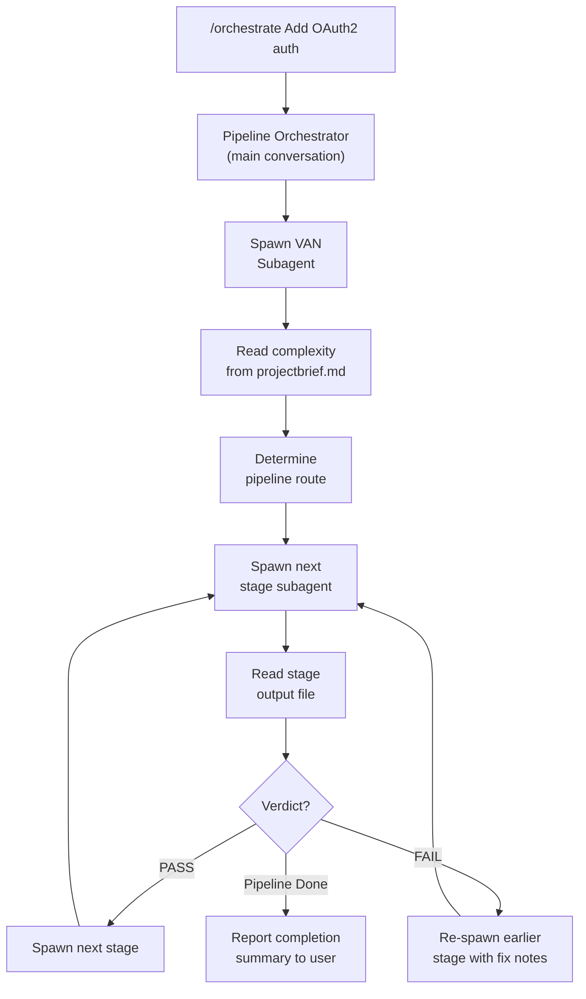

### Running the Orchestrator

```
/orchestrate Implement user authentication with OAuth2 support for Google and GitHub
```

The orchestrator will:
1. **Spawn a VAN subagent** to assess complexity and initialize Memory Bank
2. **Read the complexity level** from `memory-bank/projectbrief.md`
3. **Route the pipeline** based on level (L1: 3 stages, L2: 6, L3: 10, L4: 11)
4. **Spawn each stage as a subagent** sequentially
5. **Parse verdicts** from SCAN, JUDGE, INTEGRATE, VALIDATE, and PENTEST
6. **Route failures** automatically (e.g., SCAN FAIL → re-run BUILD with findings)
7. **Report progress** after each stage completes
8. **Summarize** the full pipeline run at the end

### Progress Updates

After each stage, you see a status line:
```
[VAN] Complete — Level 3 assessed, 10-stage pipeline
[PLAN] Complete — 5 tasks identified, 1 component flagged for creative
[CREATIVE] Complete — 1 design decision documented
[BUILD] Complete — 5/5 tasks implemented, 12 files modified
[SCAN] Complete — Score: 23/25 (92%) PASS, 0 critical, 0 high
[JUDGE] Complete — Score: 22/25 (88%) PASS
[INTEGRATE] Complete — Build passes, 45/45 tests pass
[VALIDATE] Complete — 5/5 acceptance criteria verified, PASS
[PENTEST] Complete — 0 critical, 0 high findings, PASS
[REFLECT] Complete — Pipeline finished, 0 rework cycles
```

### Failure Handling

The orchestrator handles failures automatically:
- **SCAN FAIL** (high/critical finding) → Re-spawns BUILD with scan findings attached
- **JUDGE FAIL** (score < 60%) → Re-spawns BUILD with review feedback
- **INTEGRATE FAIL** (build error) → Re-spawns BUILD; (quality issue) → Re-spawns JUDGE
- **VALIDATE FAIL** → Routes to BUILD, JUDGE, or INTEGRATE based on failure type
- **PENTEST FAIL** (code bug) → Re-spawns BUILD; (config issue) → Re-spawns INTEGRATE

After 3 failed loops on any stage, the orchestrator stops and asks for your guidance.

### Cursor vs Claude Code: When to Use Which

| Use Case | Recommended |
|----------|-------------|
| You want to review each stage's output before proceeding | **Cursor IDE** |
| You want hands-off automated pipeline execution | **Claude Code** |
| You want to skip or repeat specific stages | **Cursor IDE** |
| You want consistent end-to-end runs | **Claude Code** |
| You're learning the pipeline stages | **Cursor IDE** |
| You're running production-grade tasks | **Either** |

### Setup for Claude Code

The quickest way to set up Claude Code support in an existing project is with the bundled init script:

```bash
sh /path/to/memory-bank-system/.claude/init-memory-bank.sh /path/to/your/project
```

This creates the full `memory-bank/` directory structure, copies templates, settings, and the orchestrate skill into your project. Use `--force` to overwrite existing files:

```bash
sh /path/to/memory-bank-system/.claude/init-memory-bank.sh --force /path/to/your/project
```

Alternatively, set things up manually:

1. Ensure `.claude/skills/orchestrate/SKILL.md` exists in your project
2. Ensure `.claude/memory-bank-template/` exists (with `security/` subdirectory)

Once set up, run `/orchestrate <task description>` — that's it. No individual stage commands are needed. The orchestrator skill contains all stage agent prompts internally.

---

## Tips & Best Practices

### Starting a new task
- **Cursor:** Always start with `/van`. It's the only entry point.
- **Claude Code:** Always start with `/orchestrate`. It handles everything.
- Be descriptive in your task description. The more context you give, the better the complexity determination.
- If you disagree with the complexity level, you can tell the AI and it will adjust.

### During planning
- Review the plan in `tasks.md` before proceeding to `/creative` or `/build`.
- If the plan misses something, tell the AI before moving on.
- Make sure all design-heavy components are flagged for `/creative`.

### During creative phases
- Don't rush through design decisions. The options analysis saves time during build.
- If the AI only generates two options, ask for more.
- The decision rationale is important -- it helps the BUILD stage make the right implementation choices.

### During build
- Let the test-driven approach work. Don't skip the testing gates.
- If tests keep failing, ask the AI to reconsider the approach rather than forcing a fix.
- Update `progress.md` regularly -- it helps the AI maintain context across sessions.

### Across sessions
- Memory Bank files persist between Cursor sessions. The AI will read them on startup.
- If you've made manual code changes outside of Cursor, mention them when you resume.
- The `projectbrief.md` and `systemPatterns.md` accumulate knowledge over time. Review them occasionally.

### Git integration
- Commit your `memory-bank/` directory to your feature branch. It documents your development process.
- Consider adding `memory-bank/` to `.gitignore` on `main` if you don't want it in production.
- The archive files serve as decision logs -- useful for PR reviews.

---

## Troubleshooting

### "Command not found" when typing /van, /plan, etc. (Cursor)
- Verify you're using Cursor IDE (not VS Code)
- Check that `.cursor/commands/` directory exists in your project root
- Restart Cursor

### "/orchestrate" not available (Claude Code)
- Verify `.claude/skills/orchestrate/SKILL.md` exists in your project root
- Restart Claude Code session
- Check that the skill file has valid YAML frontmatter

### Memory Bank files not being created
- Run `/van` first -- it initializes the structure
- Check file permissions on your project directory
- Verify `memory-bank/` directory exists at project root

### AI seems to have lost context
- The AI reads Memory Bank files at the start of each command
- Check that `tasks.md` and `activeContext.md` have current content
- Re-run the current command -- it will reload context from files

### Complexity level seems wrong
- Tell the AI: "I think this should be Level X because..."
- The AI will re-evaluate and adjust
- You can also manually update the level in `tasks.md`

### Stage tells me to go back (FAIL verdict, etc.)
- This is expected behavior. Fix the issues identified in the report.
- Re-run the stage that identified the issue after fixing.
- The failure reports are specific about what needs to change.

### Want to skip a stage
- You can skip stages by just running the next command.
- Not recommended -- each stage builds on the previous one's outputs.
- If you skip, the next stage may ask you to go back.

### Multiple features in progress
- Each task uses the same `tasks.md` (ephemeral).
- Complete and archive one task before starting another.
- Or use separate git branches with separate Memory Bank states.
